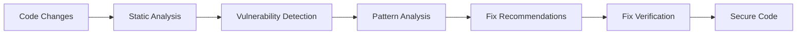

## Overview

Security agent skills equip Claude Code with professional-grade capabilities for code auditing, vulnerability detection, and security analysis. These skills are designed for security engineers, auditors, and development teams focused on building secure applications.

## Featured Skill

<Card title="Trail of Bits Security Skills" icon="shield-halved" href="https://github.com/trailofbits/skills">
  **By [Trail of Bits](https://github.com/trailofbits)**
  
  A very professional collection of over a dozen security-focused skills for code auditing and vulnerability detection. Includes skills for static analysis with CodeQL and Semgrep, variant analysis across codebases, fix verification, and differential code review.
</Card>

## Key Capabilities

The Trail of Bits Security Skills provide comprehensive security analysis tools:

### Static Analysis

<CardGroup cols={2}>
  <Card title="CodeQL Integration" icon="magnifying-glass-chart">
    Advanced static analysis using GitHub's CodeQL engine to identify security vulnerabilities and code quality issues
  </Card>
  
  <Card title="Semgrep Analysis" icon="code">
    Pattern-based code scanning to detect security issues, bugs, and anti-patterns across multiple languages
  </Card>
  
  <Card title="Variant Analysis" icon="diagram-project">
    Identify similar vulnerabilities across codebases by analyzing patterns and code structures
  </Card>
  
  <Card title="Fix Verification" icon="check-double">
    Validate that security fixes properly address vulnerabilities without introducing new issues
  </Card>
</CardGroup>

### Code Review

<CardGroup cols={2}>
  <Card title="Differential Review" icon="code-compare">
    Focus security analysis on changed code to efficiently audit pull requests and updates
  </Card>
  
  <Card title="Vulnerability Detection" icon="bug">
    Identify common vulnerability patterns including injection flaws, authentication issues, and data exposure
  </Card>
  
  <Card title="Security Patterns" icon="shield-check">
    Recognize and recommend secure coding patterns and best practices
  </Card>
  
  <Card title="Compliance Checking" icon="clipboard-list">
    Verify code adheres to security standards and compliance requirements
  </Card>
</CardGroup>

## Why Choose Trail of Bits Security Skills?

<Steps>
  <Step title="Professional Grade">
    Developed by Trail of Bits, a leading security research and auditing firm with extensive expertise
  </Step>
  
  <Step title="Comprehensive Coverage">
    Over a dozen specialized skills covering the full spectrum of security analysis needs
  </Step>
  
  <Step title="Industry Tools">
    Integrates with battle-tested tools like CodeQL and Semgrep used by security professionals
  </Step>
  
  <Step title="Production Ready">
    Battle-tested skills used in real-world security audits and code reviews
  </Step>
</Steps>

## Security Analysis Workflow

These skills enable a comprehensive security workflow:

## Use Cases

Security agent skills are essential for:

- **Security Engineers** - Comprehensive code auditing and vulnerability assessments
- **Development Teams** - Integrate security analysis into CI/CD pipelines
- **Code Reviewers** - Efficient security-focused pull request reviews
- **Bug Bounty Hunters** - Systematic vulnerability discovery
- **Compliance Officers** - Verify adherence to security standards

## Getting Started

<Info>
  **Repository:** [trailofbits/skills](https://github.com/trailofbits/skills)
  
  The repository contains production-ready security skills with comprehensive documentation. Each skill includes setup instructions, usage examples, and integration guides.
</Info>

## Additional Security Resources

<Card title="parry - Injection Scanner" icon="shield" href="https://github.com/vaporif/parry">
  **By [Dmytro Onypko](https://github.com/vaporif)**
  
  Prompt injection scanner for Claude Code hooks. Scans tool inputs and outputs for injection attacks, secrets, and data exfiltration attempts.
  
  <Note>Early development phase but worth exploring for additional security layers</Note>
</Card>

## Integration Tips

<Tip>
  Security skills work best when integrated into your development workflow:
  
  - **Use with Hooks** - Set up pre-commit hooks to run security analysis automatically
  - **PR Integration** - Add security checks to pull request workflows
  - **Combine with Testing** - Pair security analysis with TDD skills for comprehensive coverage
  - **Regular Audits** - Schedule periodic security reviews of your codebase
</Tip>

<Warning>
  While these skills provide powerful security analysis, they complement but don't replace:
  - Professional security audits
  - Penetration testing
  - Runtime security monitoring
  - Security training for development teams
</Warning>